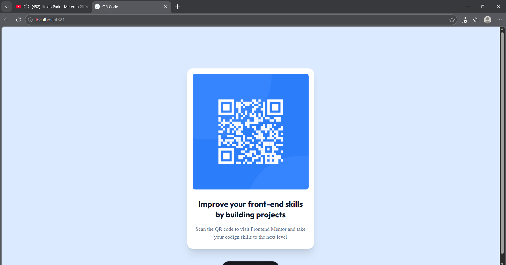

# 🏝️ Proyecto: Loopstudios Landing Page

Este proyecto consiste en el desarrollo de la **landing page de Loopstudios** utilizando **Astro** y **Tailwind CSS**.  
El objetivo es aplicar los conocimientos sobre **componentes de Astro**, **maquetación**, **estilos responsivos** y **utilidades CSS** para construir un diseño limpio, moderno y adaptable a diferentes dispositivos.

---

## 📖 Descripción general

### 🧩 Vista previa del proyecto
Agrega aquí una **captura de pantalla** del resultado final de tu landing page.  



---

### 🔗 Enlaces del proyecto

- **Repositorio en GitHub:** [Agrega aquí la URL de tu repositorio](https://github.com/)
- **Sitio desplegado (opcional):** [Agrega aquí la URL del proyecto desplegado, si usaste Vercel o Netlify](https://)

---

## 🧠 Proceso de desarrollo

### 🛠️ Tecnologías utilizadas
Lista las herramientas y tecnologías que utilizaste en el proyecto. Por ejemplo:

- [Astro](https://astro.build)
- [Tailwind CSS](https://tailwindcss.com/)
- HTML5 semántico
- Diseño responsivo (Mobile-first)
- Componentes de Astro reutilizables

---

### 💡 Lo que aprendí
En esta sección describe brevemente **qué aprendiste o reforzaste** al desarrollar este proyecto.  
Puedes incluir fragmentos de código o mencionar conceptos nuevos que aplicaste.

En este proyecto aprendí a estructurar de mejor manera proyectos utilizando el framework **Astro,** reforcé mis conocimientos en Tailwind.

Fragmento de Código:

```html
<Layout>
	<QRCode />
</Layout>
```

---

### 🚀 Áreas de mejora

Menciona aquí los aspectos que podrías mejorar o seguir practicando en futuros proyectos.

- Mejorar el manejo del responsive en pantallas pequeñas.  
- Mejorar el uso de Tailwind.  
- Optimizar la estructura del proyecto y el uso de componentes.  

---

### 📚 Recursos útiles

Incluye los enlaces, documentación o tutoriales que te ayudaron a completar este proyecto.

- [Documentación de Astro](https://docs.astro.build)  
- [Guía oficial de Tailwind CSS](https://tailwindcss.com/docs)  
- [Tailwind CSS classes](https://tailwind.build/classes)
- [Astro Quick Start Course | Build an SSR Blog](https://youtu.be/XoIHKO6AkoM?si=aBwPAL3yEpCWtdeM)

---

### 👩‍💻 Autor

- **Nombre completo: Angel Gabriel Palacios Medina**  
- **Carrera: Ing. TICs**  
- **Grupo: AEB1055 TC1**  
- **Correo institucional: 23151226@aguascalientes.tecnm.mx**  

---

### ✨ Reflexión final

Comparte brevemente tu experiencia durante el desarrollo del proyecto.  
Puedes responder a preguntas como:

- ¿Qué fue lo más fácil de realizar?  
Lo más fácil de realizar fue la estructuración del proyecto (layout, componentes, index).

- ¿Cómo aplicarías lo aprendido en proyectos futuros?
Este proyecto me ayudo a mejorar la forma en que estructuro los proyectos, además de ayudarme a practicar Tailwind, ya que se me dificulta encontrar la clase que necesito aplicar. Lo anterior me ayudaría en proyectos futuros en la organización y diseño.
